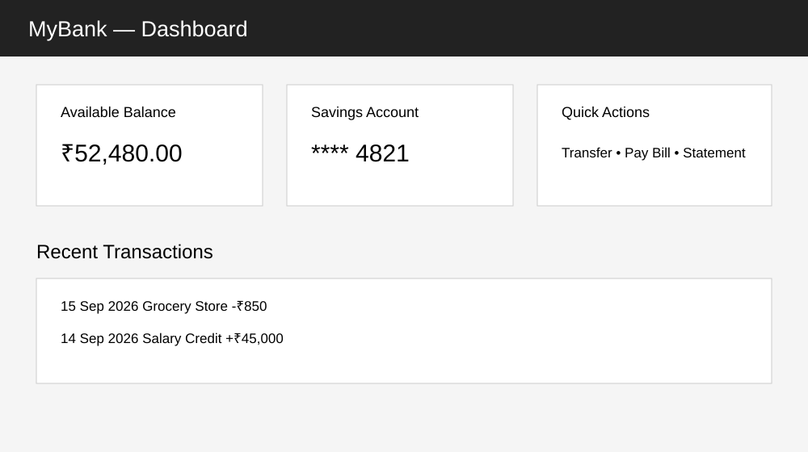
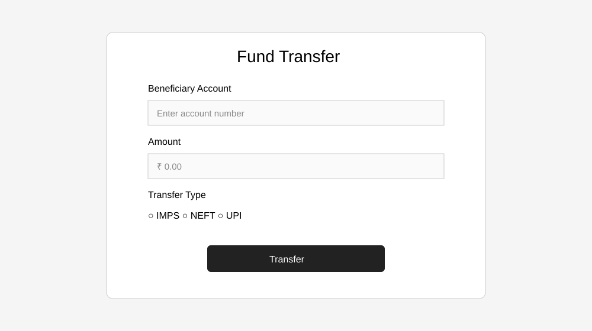
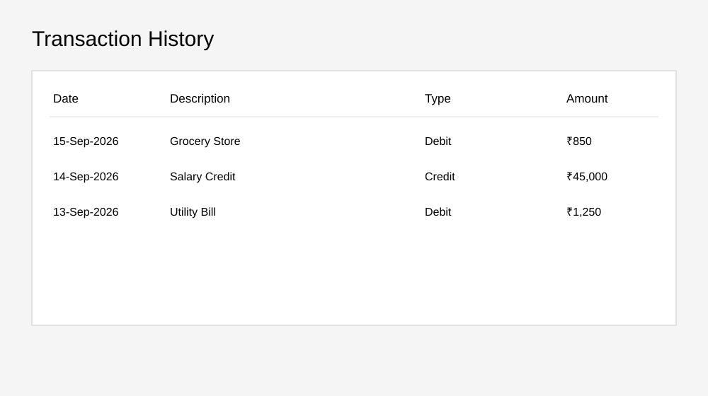

# Banking Application Testing

Portfolio QA project combining manual testing artifacts, SQL validation, and Selenium + Java automation against the public ParaBank demo application.

## Scope
- Functional and negative testing of login, account overview, and fund-transfer navigation
- Test planning, test cases, test data, bug reporting, and SQL validation
- Selenium WebDriver automation using Java, JUnit 5, Maven, and Page Object Model

## Automation
The `src/test/java` suite contains smoke scenarios for:
1. Valid login and account-service availability
2. Invalid login error handling
3. Access to the Transfer Funds page

The automation targets the public ParaBank demo application.

> **Note:** ParaBank is a public demo/test application. The automation uses documented demo credentials for portfolio testing. Do not use real banking credentials or real financial data.

## Screenshots

### Banking Dashboard


### Fund Transfer


### Transaction History


> These images are UI reference/portfolio mockups and are included to visually document the testing scenarios. They are not presented as proof of a live production banking system.

## Project Structure
```text
Banking-Application-Testing/
├── Bug-Reports/
├── Screenshots/
│   ├── banking-dashboard.svg
│   ├── fund-transfer.svg
│   └── transaction-history.svg
├── SQL/
├── Test-Cases/
├── Test-Data/
├── Test-Plan/
├── src/test/java/com/keerthi/qa/
│   ├── BaseTest.java
│   ├── LoginPage.java
│   ├── AccountsPage.java
│   └── BankingSmokeTest.java
├── pom.xml
└── .gitignore
```

## Tech Stack
Java 17 | Selenium WebDriver | JUnit 5 | Maven | SQL | Manual Testing | Page Object Model

## Run Automation
Prerequisites: JDK 17+, Maven, and Google Chrome.

```bash
mvn clean test
```

Selenium Manager handles browser driver setup in current Selenium versions.

## Manual Testing Artifacts
- Test cases for banking workflows
- Test plan and test data
- Sample bug reports
- SQL queries for transaction/balance validation
- UI reference screenshots

## What This Project Demonstrates
- Manual test case design and negative testing
- Selenium WebDriver automation with Java
- Page Object Model (POM)
- JUnit 5 test execution
- Maven project structure
- SQL-based validation concepts
- Defect documentation and test planning

This repository is a portfolio project designed to demonstrate QA test design, automation structure, SQL validation, and defect documentation.